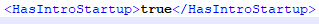
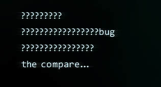

# IntroStartup&HackerScripts

## 1.    IntroStartup

详见以下例子：

```text
-------------You received a new message-------------
Hi. This thing looks so wired…

Nevermind.

Agent, I need your help…

My name is Pitiedwzr, be ready for your unforgettable journey.
------------- B O O T I N G-------------
```

那么这一段代码要如何实现呢？

First, 在你的拓展文件夹内新建一个txt文档，并改名为Intro.txt

然后在里面输入你想要的内容 接下来保存

接下来打开ExtensionsInfo.xml 将HasIntroStartup设置成true

 （设置成false可以跳过启动画面，便于测试）

接下来就是对于文段的讲解

由于Hacknet令人生草的设置，IntroStartup不能设置中文，否则就会出现如下结果

 图中的???????就是我输入的中文（这是在语言设置为en-us时，在zh-cn下是方框）

那要如何输入中文呢？

留给你一个小问题

## 2.    HackerScript

HackerScript是一个黑客的脚本，最经典的脚本就是Naix的脚本了

下面我们就以Naix的脚本来分析HackerScript

```text
config [TARGET_COMP] [SOURCE_COMP] 0.2 $#%#$
connect $#%#$
delay 2 $#%#$
openPort 21 $#%#$
openPort 22 $#%#$
openPort 25 $#%#$
openPort 80 $#%#$
delay 2 $#%#$
stopMusic $#%#$
clearTerminal $#%#$
writel WHO $#%#$
writel DO $#%#$
writel YOU $#%#$
writel THINK $#%#$
writel YOU $#%#$
writel ARE $#%#$
writel ? $#%#$
delay 2 $#%#$
delete /sys x-server.sys $#%#$
startMusic $#%#$
forkbomb $#%#$
disconnect $#%#$
```

对于这段文本，我们就来分析一下它的成分

`config [TARGET_COMP] [SOURCE_COMP] 0.2 $#%#$`

每个HackerScript必须且一定要打在开头的部分

TargetComp：目标PC

SourceComp：攻击者PC

关于targetcomp和sourcecomp，我们会在Actions章节讲解

0.2：基础延迟 每一个命令都会在上个命令执行完毕后0.2s之后触发，可调节

`connect $#%#$`

连接到目标PC上，如果那是玩家的电脑，就会显示INCOMING CONNECTION的红条

`delay 2 $#%#$`

延迟。与基础延迟不同，他是专门在上个命令执行完毕后等待2s再触发下个指令，可以与基础延迟叠加

`openPort 21 $#%#$`

开放21号端口。 你也可以更改数字号来改变开放的端口。

`stopMusic $#%#$`

停止音乐，这个不经常用到

`clearTerminal $#%#$`

清除Terminal窗口，相当于打clear指令

`writel WHO $#%#$`

在Terminal窗口上显示内容，若使用中文会造成和Intro一样的乱码效果

`delete /sys x-server.sys $#%#$`

删除sys文件夹下的x-server.sys 若将x-server.sys替换成\* 则为清空sys文件夹

`forkbomb $#%#$`

使你的电脑蓝屏… 有的时候为了让你的剧情变得更加精彩可以使用这个

`disconnect $#%#$`

断开链接，没多大必要，还会在PC上留下断链日志

这个就是Naix黑入你电脑并删除你电脑上x-server.sys的脚本

**但是！**

相信玩过几周目的玩家都知道,Forkbomb是可以在手速快的情况下kill掉的

这就需要更高级的黑客脚本：

```text
config [TARGET_COMP] [SOURCE_COMP] 0.2 $#%#$
hideRam $#%#$
clearTerminal $#%#$
delay 2 $#%#$
writel Alert! $#%#$
delay 2 $#%#$
writel ——FinalEnd Emergency Attack——$#%#$
delay 2 $#%#$
writel Sorry.$#%#$
delay 2 $#%#$
delete /sys x-server.sys $#%#$
writel Y O U A R E C O N N E C T I N G$#%#$
delay 2 $#%#$
writel A S P E C I A L N O D E $#%#$
delay 3 $#%#$
writel It's time. . . . . . $#%#$
delay 2 $#%#$
writel Good Bye.$#%#$
delay 3 $#%#$
writel ——Memory Overflow——$#%#$
delay 2 $#%#$
forkbomb $#%#$
forkbomb $#%#$
forkbomb $#%#$
forkbomb $#%#$
showRam $#%#$
forkbomb $#%#$
delay 0.25 $#%#$
writel —FinalEnd Emergency Attack Completed—$#%#$
disconnect $#%#$
```

为大家标注的红色的地方就是值得注意的地方

`hideRam $#%#$`

此命令能够隐藏你的RAM栏（0MB\/761MB那个） 你将看不到Forkbomb的显示 但是需要showRAM为玩家再次显示RAM栏，否则RAM栏将一直不会显示 （或许可以做一些奇怪的东西）

```text
forkbomb $#%#$
forkbomb $#%#$
forkbomb $#%#$
forkbomb $#%#$
showRam $#%#$
forkbomb $#%#$
```

forkbomb是可以叠加的，所以多个forkbomb可以让电脑瞬间爆炸

另外夹了一个showRam也是照应上面，令玩家重新看到Ram

**但是！**

你以为这么简单吗？

有的大佬甚至可以不用看Ram，仅仅只用Terminal窗口就可以kill你的forkbomb

所以，我们还有更加高级的办法去解决。这一个方法我会和Hackerscripts的触发一并放在Actions章节讲解。

